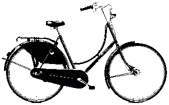

Le 10 novembre, c'est une date nationale pour revendiquer des politiques 
favorables au déplacement à vélo. <!--more-->Plusieurs villes se mobilisent, et nous 
espérons que le sujet va faire autant de bruit [qu'il en a fait 
un an plus tôt à Montpellier !][montpellier]

A Pau, nous ferons entendre que l'heure du vélo est venue. Les réveils vont 
sonner, les gros dormeurs vont se réveiller, ceux qui n'aiment pas être en 
retard seront déjà en selle ! Quand aux autres, ils pédaleront pour rattraper 
les temps qui courent !

**Départ Square Aragon à Pau, toutes les demi-heure entre 15h00 et 18h00, pour une 
boucle d'environ 20 mn.** Accompagnez une ou plusieurs boucles selon votre envie
et votre disponibilité !

Venez avec un slogan en tête, de la joie au coeur, des amis, des boites de 
conserve attachées à des fils, des sonneries de portable, des enceintes à musique, des sonnettes,
des crécelles, ou tout autre ustensile suceptible de faire du bruit à vélo. 
Si vous n'avez rien de tout ça, venez juste avec un vélo, et quelques habits 
quand même, sinon vous seriez tous nus !

Le 10 novembre 2069, il est probable qu'on célebrera en grande pompe les 50 ans
de ce jour décisif pour la paix et la qualité de vie en milieu urbain ! Ce jour
de grande bataille contre le réchauffement climatique, la pollution, 
l'épuisement des ressources, le manque d'activité physique, l'insécurité 
routière... Ceux qui seront encore vivant raconteront avec émotion et fierté 
qu'ils étaient là ce jour là. L'admiration mêlée d'envie et de respect pourra se
lire dans tous les yeux !

[montpellier]: https://www.midilibre.fr/2018/11/10/montpellier-ils-netaient-pas-2-mais-1200-a-manifester-a-velo,4830666.php