Le chantier pour le passage du Fébus à l'intersection avec le Boulevard
Alsace Lorraine prend fin, et la [vraie stratégie de mobilité douce]
affichée par la mairie se traduit dans les faits par une vraie débâcle
 sur cette zone, qui reste très hostile au vélo. Reportage dans cet article, 
les propositions d'amélioration dans [un autre billet][1]. Nous nous 
concentrons sur les portions rénovées, même s'il y aurait beaucoup à dire sur 
le reste de ce boulevard.

## Longer le boulevard Alsace-Lorraine

### En allant vers l'ouest, vers la foire expo

Si on arrive sur le Boulevard Alsace Lorraine de l'est, côté clinique, pour aller
tout droit vers l'ouest, côté foire expo...

Sous couvert de limitation à 30km/h, la voie vélo disparait pour faire apparaitre
une voie voiture. Une "magie" très à la mode dans les années 1980 et
qui conserve apparemment son succès à Pau en 2019.

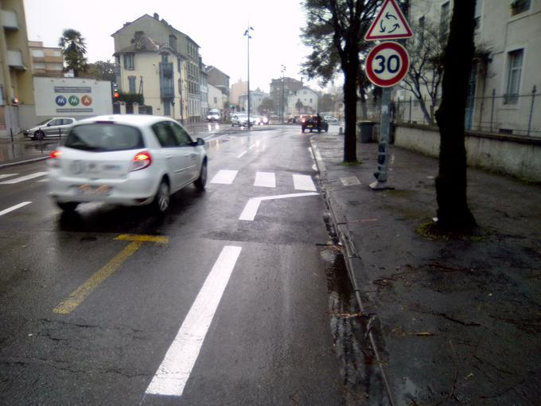

Juste après on se retrouve sur un rond point double-voie. Rien de tel pour donner
envie de circuler à vélo!

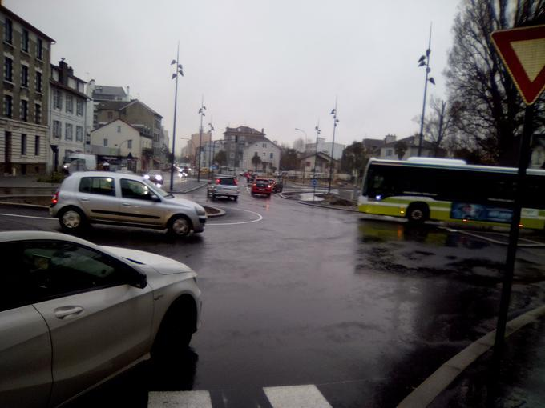

Mais le meilleur reste la sortie du rond-point: il faut s'insérer entre les
deux voies voiture pour aller tout droit jusqu'au prochain rond-point ! 
Les débutants prenant la bonne résolution du déplacement à vélo
apprécieront surement l'exercice. Au moins autant que ceux qui tenteront d'y
accompagner leur enfant de 6 ou 7 ans à vélo (à cet âge là ça ne tient plus
sur le siège enfant).

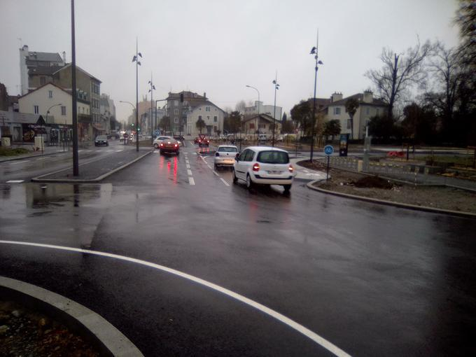

Les sigles vélos, qui ont été apposés récemment, ne changent pas le fond du
problème. Bientôt ils ne feront que rappeler la mauvaise tenue des peintures 
et leur entretien erratique.

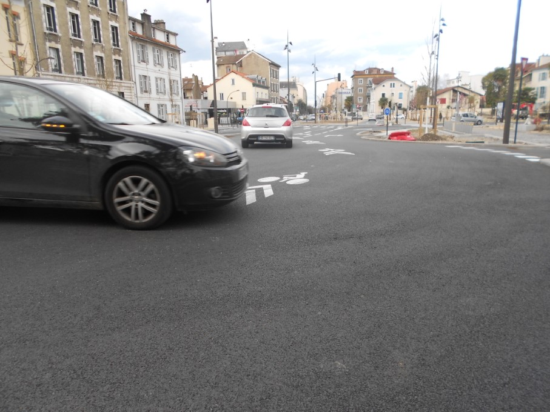

### En allant vers l'est, vers la clinique

On commence par nous rapprocher des véhicules stationnés en 
supprimant la distance de sécurité protégeant des portières qui s'ouvrent.

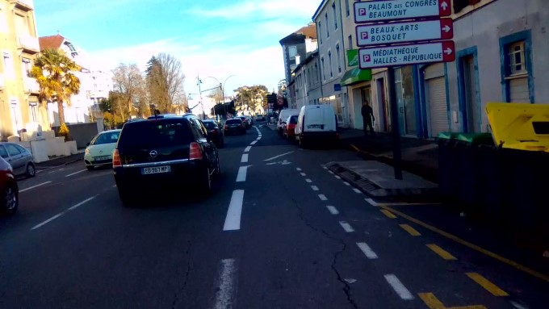

la distance de sécurité ne réapparait pas le long des stationnements devant les
restaurants, où on observe de nombreux arrêts minutes (donc autant d'ouverture
de portières que de visiteurs-minute).

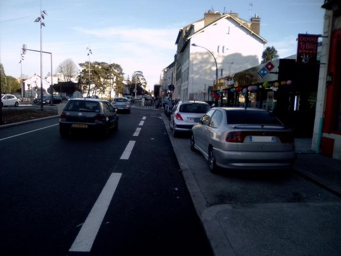

La bande n'est pas non plus protégée contre les acheteurs de pizza en voiture 
qui préfèrent souvent s'entasser sur la piste cyclable plutôt que penser à la 
solution vélo.

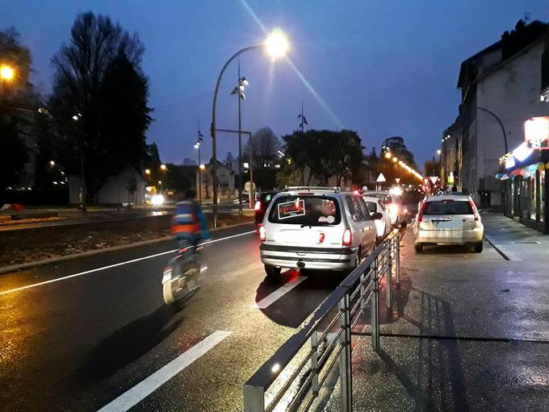

Débutants: n'oubliez pas de regarder derrière avant de vous engager sur
la voie voiture pour contourner l'obstacle.

## Franchir le boulevard Alsace-Lorraine

Les pistes cyclables réalisées au nord du Boulevard Alsace Lorraine à l'occasion
des travaux pour le passage du Fébus donnent envie de se mettre au vélo. Aux 
heures de pointe, on peut y jouer à saute-bouchon avec plaisir. Tout le problème 
est d'accéder à ces pistes depuis le centre-ville, et inversement...

### Pour sortir du centre ville

Quand on vient du centre-ville, si on ne veut pas se confronter aux [rues rénovées 
sans aucun aménagement cyclable] malgré un trafic conséquent, remonter la rue Carnot peut
sembler une option intéressante. Mais comme Moïse, vous ne serez pas autorisé
à fouler la terre promise ! 

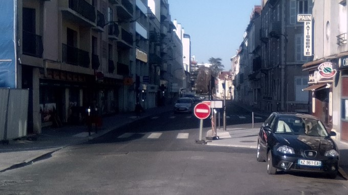

Alors que le boulevard Alsace-Lorraine est en vue, un sens interdit "même pour 
les vélos" met fin à votre aventure. **VOUS NE PASSEREZ PAS !**

<video controls width="100%"><source src="vous-ne-passerez-pas.mp4" type="video/mp4"></video>
 

### Pour venir au centre ville

Dans l'autre sens, alors qu'on profite des nouvelles pistes sur l'avenue Dufau, 
la dégradation de la cyclabilité est palpable à l'approche du boulevard 
Alsace-Lorraine: on commence par transformer la _piste cyclable séparée_ en 
_bande sur chaussée (trait de peinture)_.

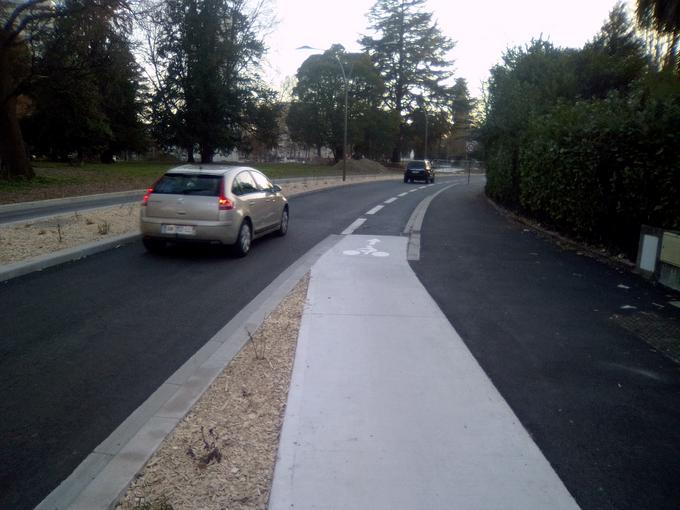
 
puis une voie motorisée supplémentaire est rajoutée 

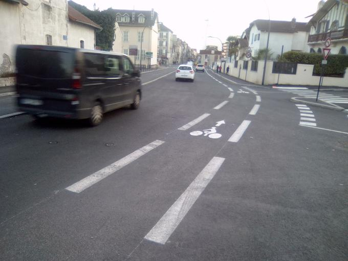

Finalement, on débouche sur un rond-point double-voie dans lequel ont doit 
s'insérer, et où les voitures qui tournent à droite mordent la bande cyclable
non protégée. Autant dire que le cycliste n'est pas en territoire conquis.

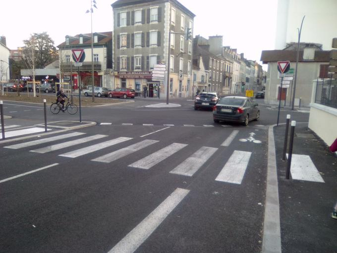

Pierre Grand a écrit [un courrier à la mairie] avec [des photos] pour faire part du manque de 
sécurité pour les cyclistes aux abords de ce rond point et réclamer un aménagement
similaire à celui du boulevard Hauterive. Il a également envoyé [une relance], et
évoqué le sujet avec M. Brin.

En continuant tout droit sur Carnot, la piste cyclable longe des stationnements, 
coinçant les cyclistes au côté des ouvertures de portières.

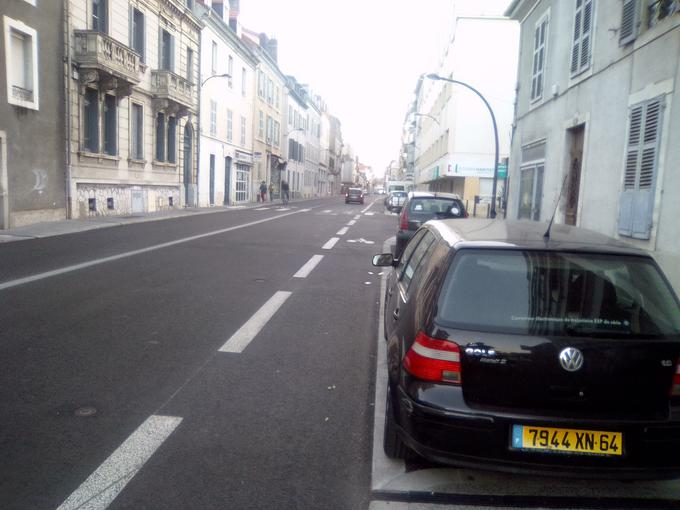

## Quelle stratégie ?

Rupture de bande et rond point double file, rupture d'itinéraire, 
passage à risque proche de stationnements, environnement provoquant le 
stationnement sur bande, circulation entre plusieurs files de voitures, autant 
de problèmes posés au vélo sur cette voirie toute neuve. Les stratèges de la 
mobilité douce ont de belles marges de progrès... 

Notre maire répète souvent que le kilométrage de voies cyclables à Pau en fait 
la deuxième ville française derrière la Rochelle, pour les villes 
de taille similaire. Mais si la sécurité n'est pas au rendez-vous, la quantité 
ne sert à rien, et ces kilomètres de voies cyclables resteront autant de 
chemins ne menant nul part, à part au rejet du déplacement à vélo. 

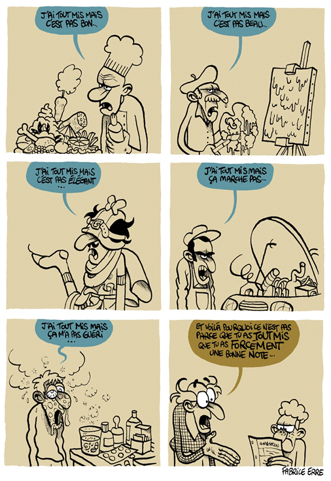   



Frédéric Héran donne une analyse en lien avec notre constat :

> Dans un premier temps, elles (les collectivités) se sont rendu compte qu'il ne
suffit pas de réaliser des aménagements cyclables, encore convient-il que le
réseau soit suffisamment dense et maillé, **avec un niveau de sécurité homogène**.
Un effort de programmation se révèle indispensable à travers la mise au
point d'un schéma directeur des itinéraires  cyclables précisant les axes
structurants et les aménagements prioritaires. Cela passe par **le repérage et
le traitement  des  discontinuités**,  dont on peut  distinguer trois
catégories selon l'échelle considérée :
>
> 1. les  petits  obstacles  gênants (une  bordure  trop  haute,  une  plaque  d'égout dangereuse,  une  chicane
trop  serrée,  un  revêtement  défectueux...)  ;
> 2. les  obstacles  plus
importants  qui dissuadent  déjà  de  circuler  à  vélo  (un  carrefour  non
aménagé,  une  bande cyclable  envahie  par  du  stationnement  illicite,  une
  artère  sans  aménagement  cyclable,  un sens interdit...) ;
> 3. enfin, les coupures urbaines, telles que les infrastructures 
infranchissables ou les grandes emprises non traversables, qui interdisent tout
passage d'un quartier à  l'autre ou obligent le cycliste à de larges détours 
très décourageants.
>
> En France, certaines villes n'en sont pas encore à traiter les
micro-obstacles pendant  que d'autres s'attaquent déjà aux obstacles plus
importants. Rares sont celles qui, comme Strasbourg, ont une politique, assez
coûteuse mais indispensable, de traitement systématique des coupures par des
passages dénivelés.

## Notre proposition

On en parle dans [un autre billet][2]

Note: la planche de BD a été prise sur <a href="http://uneanneeaulycee.blog.lemonde.fr/2016/03/14/correction-le-retour/">ce blog</a> les notes sont issus du <a href="https://www.parlons-velo.fr/barometre-villes-cyclables">baromètre des villes cyclables 2018</a>

[1]: /blog/2019/reconquerir-alsace-lorraine-a-velo/
[2]: /blog/2019/reconquerir-alsace-lorraine-a-velo/
[vraie stratégie de mobilité douce]: https://www.pau.fr/article/le-velo-au-coeur-d-une-vraie-strategie-de-mobilites-douces
[rues rénovées sans aucun aménagement cyclable]: https://www.facebook.com/pauaveloo/videos/172924026979616/
[un courrier à la mairie]: 20190124-pierre-grand-dufau-lorraine.pdf
[des photos]: photos-pierre-grand-dufau-hauterive.pdf
[une relance]: 20190214-pierre-grand-dufau-lorraine.pdf
