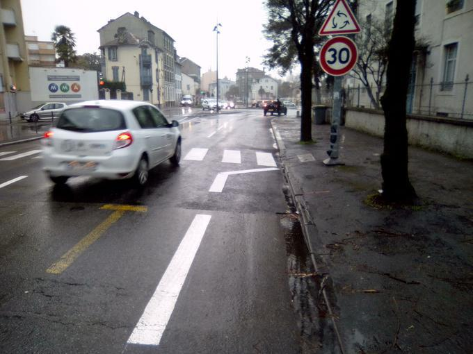
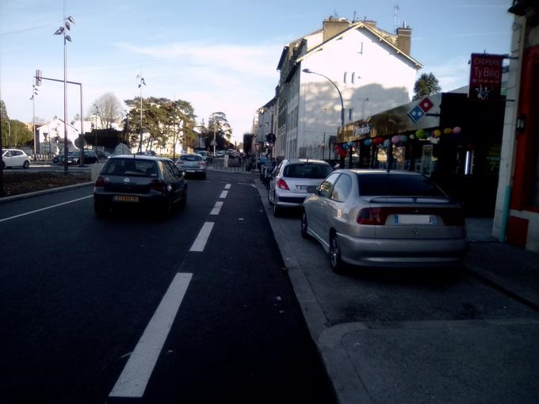
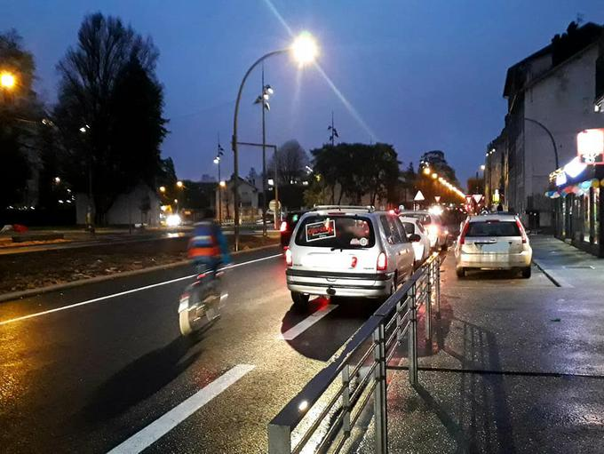
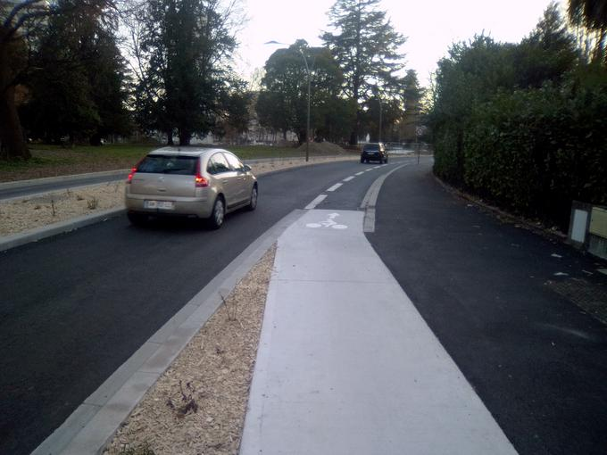
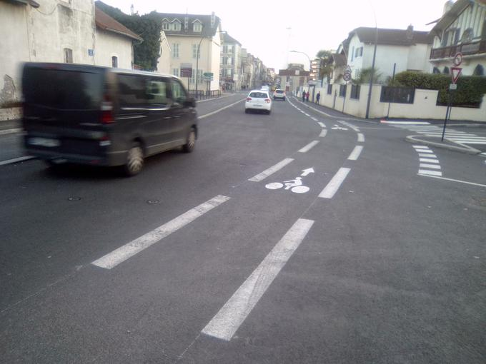
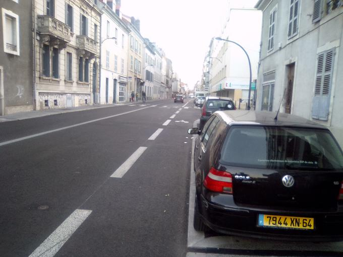
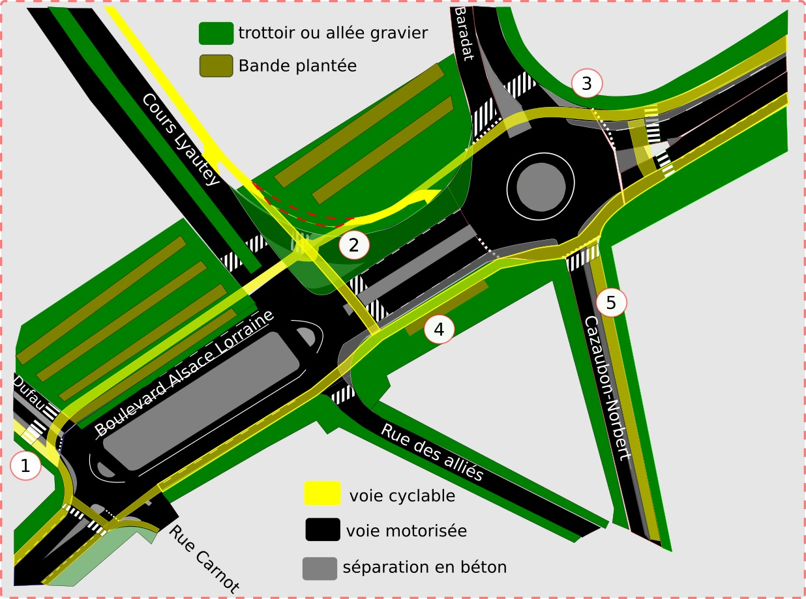
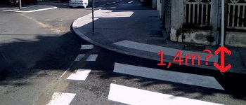

Les travaux pour le passage du Fébus à l'intersection avec le Boulevard 
Alsace Lorraine prennent fin, et on découvre un aménagement
très hostile à la pratique du vélo.

## Constats

### Sur Alsace Lorraine
Si on arrive sur le Boulevard Alsace Lorraine de l'est, côté clinique, pour aller 
tout droit vers l'ouest, côté foire expo... 

Sous couvert de limitation à 30km/h, la voie vélo disparait pour faire apparaitre
une voie voiture. Une "magie" très à la mode dans les années 1980 et 
qui conserve apparemment son succès à Pau en 2019.

Juste après on se retrouve sur un rond point double-voie, ou 
beaucoup de cyclistes ne se sentiront pas en sécurité.

Mais le meilleur reste la sortie du rond-point: il faut s'insérer entre les
deux voies voiture pour aller tout droit jusqu'au prochain rond-point !

Dans l'autre sens, on longe un stationnement sans distance de sécurité contre
les portières qui s'ouvrent.

La bande n'est pas non plus protégée contre les acheteurs de pizza qui préfèrent souvent
s'entasser sur la piste cyclable plutôt que penser à la solution vélo 

### Sur Dufau puis Carnot
Quand on vient du Nord, sur l'avenue Dufau, le long des pistes du Febus, la dégradation de la cyclabilité
est palpable: on commence par transformer la _piste cyclable séparée_ en _bande
sur chaussée (trait de peinture)_.

 
puis une voie motorisée supplémentaire est rajoutée 

Finalement, on débouche sur un rond-point double-voie dans lequel ont doit 
s'insérer, et où les voitures qui tournent à droite mordent la bande cyclable
non protégée

Pierre Grand a écrit [un courrier à la mairie] avec [des photos] pour faire part du manque de 
sécurité pour les cyclistes aux abords de ce rond point et réclamer un aménagement
similaire à celui du boulevard Hauterive. Il a également envoyé [une relance], et
évoqué le sujet avec M. Brin.

Si on continue tout droit sur Carnot, quelques stationnements motorisés ont été
mis en place, coinçant les cyclistes au côté des ouvertures de portières.

Cette intersection semble avoir été conçue pour décourager tout ceux qui voudraient
se mettre au vélo !

Mais alors il aurait fallu faire quoi?

## Proposition

Peut être ne pas doubler systématiquement les voies voitures aux abords des
intersections, et proposer une traversée à l'abri pour les vélos, comme 
suggéré sur ce plan !

### légende
1. Le dédoublement motorisé de Dufau à l'approche du rond point est supprimé, 
plus de place pour séparer le vélo. La trajectoire vélo est déportée pour 
assurer un croisement à la perpendiculaire avec les véhicules motorisés qui 
tournent. Le croisement est sur un plateau.
2. Le tourne à droite motorisé est supprimé, un accès vélo est créé pour ceux 
qui viendraient via la voie de bus (alliés) pour aller vers lyautey ou tourner 
à gauche. Le tracé actuel de la piste cyclable est en pointillés rouges
3. Pas de dédoublement de la voie motorisée en arrivant sur le rond point, plus
 de place pour séparer le vélo, qui monte sur le plateau avant d'aborder le 
croisement. Piétons et vélos traversent ensuite l'avenue baradat sur le plateau.
4. La voie cyclable monte sur l'actuel trottoir pour rester séparée de la 
circulation
5. Une des deux voies motorisée de Cazaubon-Norbert laisse la place à une voie 
cyclable séparée de la chaussée. L'occasion peut-être d'élargir le trottoir
à l'arrivée vers Alsace Lorraine, dont la largeur ne respecte pas les contraintes
légales pour une rénovation (1,4m libre d'obstacle). 

### commentaires supplémentaires
* Partout, les bandes cyclables sont élargies pour faire minimum 1,5m 
* Les insertions et sorties des cyclistes sont protégées par un aménagement en 
béton dans la plupart des cas
* Suppression du stationnement devant la pizzeria et mise en place de plots
protégeant contre le stationnement intrusif.

[un courrier à la mairie]: 20190124-pierre-grand-dufau-lorraine.pdf
[des photos]: photos-pierre-grand-dufau-hauterive.pdf
[une relance]: 20190214-pierre-grand-dufau-lorraine.pdf