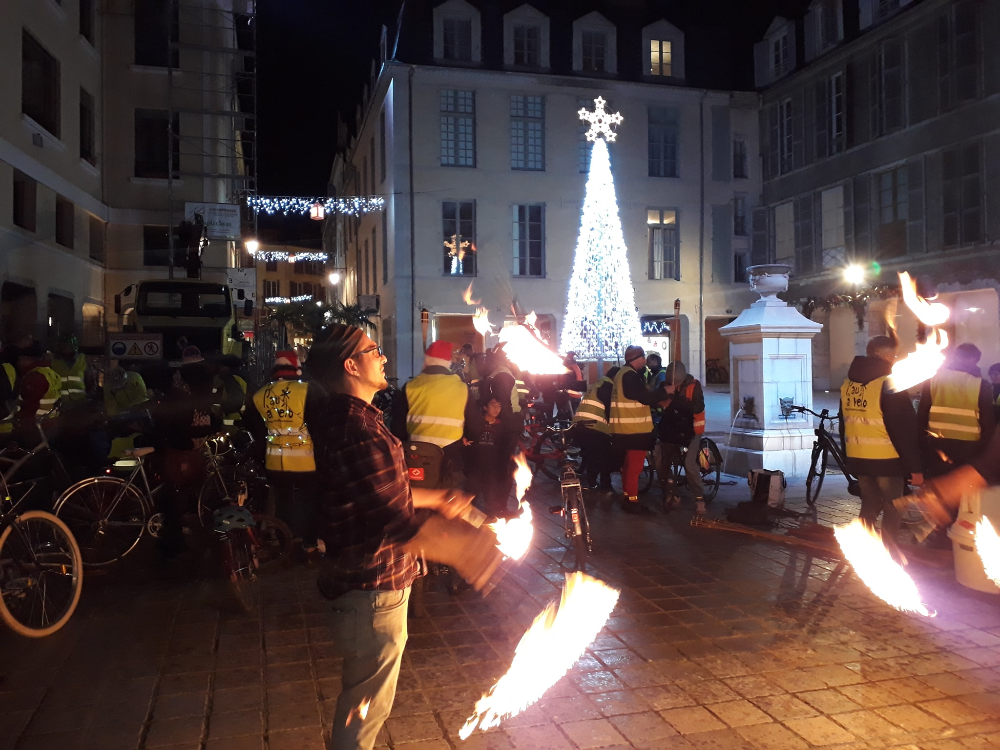

Ce 6 décembre dans les rues de Pau, les vélos ont brillé de mille feux ! 

Le rendez-vous été donné place de la reine Margueritte, où un jongleur de feu
a donné le ton!

Une fois les éclairages allumés, les cylclistes ont déambulé dans le centre-ville 



Puis ils se sont dirigés vers la voie verte longeant l'Université, le long de laquelle des flambeaux avaient été disposés pour éclairer ce cheminement habituellement sombre. Il ne serait pourtant pas difficile d'améliorer les conditions de circulation des piétons et cyclistes qui l'empruntent quotidiennement à des horaires où il fait nuit en hiver.



Pau à vélo avait écrit [une lettre à la mairie et à l'université à ce sujet][lettre] le 26 octobre qui
a reçu un accusé de réception automatique de la mairie. Une relance a été envoyée le 6 novembre, et nous a permis d'apprendre que cette voie relève de la compétence de la mairie, et que notre demande était étudiée par les services compétents. Visiblement cependant, les services compétents n'ont pas encore trouvé la voie vers une réalisation concrète. Peut-être pour l'hiver prochain ?

Cette animation nous a valu [un article dans la république][la rép], qui parle
également des [premiers résultats du baromètre des villes cyclables][baromètre]

Pour les adhérents qui s'étaient inscrit, la soirée était également l'occasion de se retrouver ensuite au restaurant pour le repas annuel de l'association.

[la rép]: https://www.larepubliquedespyrenees.fr/2019/12/07/securite-des-cyclistes-a-pau-une-carte-cible-les-rues-et-carrefours-dangereux,2635624.php
[baromètre]:/blog/2019/premiers-resultats-du-barometre-villes-cyclables-2019/
[lettre]: pau-a-velo-mail-eclairage-piste-universite.pdf