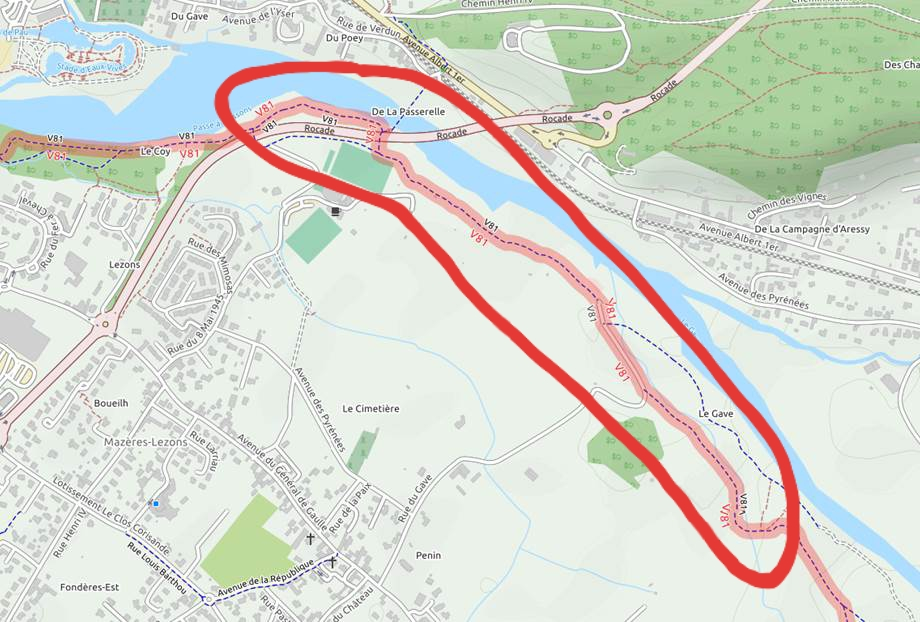

À la moindre pluie, la v81 à Mazères-Lezons se retrouve envahie de flaques 
immenses. Un de nos administrateur a envoyé un courriel à ce sujet, dont nous 
retranscrivons ici le contenu.

<!--more-->

> **Sujet** : 	Inondation récurrente de la véloroute V81 à Mazères-Lezons  
> **Date** : 	17 avril, 17h18  
> **De** : 	Hervé LAURENT  
> **Pour** : 	Direction des mobilités de l'agglomération paloise, Mairie de Mazères-Lezons, Laurence PAULY (Département 64), Véronique HOURCADE MEDEBIELLE (Services techniques agglo), Arnaud BINDER (Direction des mobilités)  
> **Copie à** : 	Pau à Velo  

> Bonjour,
> 
> Comme de plus en plus de personnes aguerries à la pratique cyclable, j’emprunte
> quotidiennement la véloroute V81 pour me rendre sur mon lieu de travail. Je 
> circule le matin entre Pau et le pont d’Assat sur la rive gauche du gave, et le
>  soir en sens inverse.
> 
> Ce mardi 16 avril au matin, comme après chaque épisode pluvieux, sur la commune
>  de Mazères-Lezons, le tronçon de cette voie situé entre le pont sec de la 
> rocade et la passerelle en bois sur le Canal du Moulin présentait de nombreux 
> passages inondés (partie cerclée de rouge sur la carte ci-dessous).
> 
> 
> 
> Cette situation n’est pas de nature à encourager d’avantage de personnes (les 
> moins aguerries) à choisir le vélo comme moyen de déplacement alternatif à 
> l’automobile sur un trajet où ils peuvent pourtant être mis en concurrence.
> 
> Les photos ci-jointes montrent plusieurs passages où la circulation doit être 
> fortement ralentie afin d’éviter les projections d’eau et les glissades. Une 
> situation aussi récurrente serait inacceptable sur une voie où circulent des 
> véhicules motorisés. Doit-elle l’être pour une voie réservée aux mobilités 
> alternatives ?
> 
> Il est regrettable de constater que ce tronçon n’a pas encore été aménagé aussi
> qualitativement que les portions traitées courant année 2018 dans la 
> continuité de cette véloroute vers l’Est. L’eau s’y accumule car le chemin est 
> souvent creusé par rapport aux surfaces environnantes. La pose d’un nouveau 
> revêtement sur une épaisseur de quelques centimètres suffirait à améliorer la 
> situation, en nivelant cette surface de façon à favoriser l’écoulement de l’eau
>  vers les bords.
> 
> Le problème ayant déjà été remonté à plusieurs reprises, j’imagine que des 
> solutions de ce type ont déjà été étudiées, mais j’aimerais beaucoup connaître 
> les raisons expliquant que la solution vélo soit temporairement mise en attente
>  d’une rénovation de ce tronçon.
> 
> Les beaux jours arrivent, et avec eux la période de l’année où nombreuses sont 
> les personnes qui envisagent un report modal. Quand les premières expériences à
> vélo se déroulent dans de bonnes conditions, beaucoup sont près à opter pour 
> ce mode de déplacement sur du long terme. Nous permettant de rêver à une 
> multiplication par trois de la part des déplacements quotidiens réalisés à vélo…
> 
> Cordialement,
> 
> Hervé LAURENT
> Association Pau à Vélo
>
> 