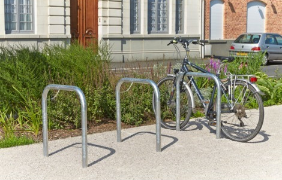
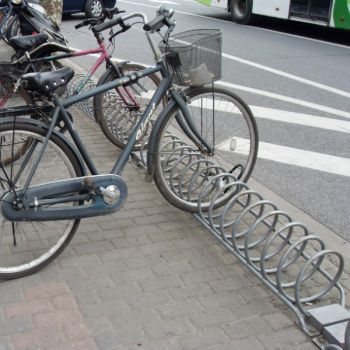

Un de nos adhérents s'est inquiété du stationnement à la future halle bio de
Billère, et à écrit un courrier au service d'urbanisme que nous retranscrivons
ici:

Mail envoyé le 18 juin au service urbanisme, relancé le 29 août aux services
techniques, car resté sans réponse.

> **Sujet :** stationnement vélo au marché bio
> 
> Bonjour,
> 
> Sur [les esquisses du cabinet d'architecte], on remarque la présence de vélos. 
> Au sein de l'association Pau à Vélo, nous aimerions s'il vous plaît savoir :
> 
> * si une zone de stationnement vélo est prévue devant votre futur marché bio ?
> * si oui, quel serait le type de stationnement choisi : arceaux ou râtelier ?
> 
> **Arceaux**
>
> 
> 
> **Ratelier**
>
> 
> 
> Concernant ce 2e point, nous voudrions vous encourager à opter pour les 
> arceaux. En effet, le râtelier pose les problèmes suivants à l'usage :
> 
> * difficile voire impossible d'y attacher le cadre de son vélo avec un antivol U ;
> * si pneu trop gros, impossible d'insérer sa roue dans le râtelier ;
> * si pneu étroit, le vélo n'est pas bien maintenu.
> 
> À l'inverse, les arceaux en nombre conséquent sont la solution de stationnement
> la plus pratique et la plus sûre pour n'importe quel type de vélo. D'ailleurs 
> j'ai vu que des arceaux avaient été installés rue Françoise-Héritier, super !
> 
> Merci d'avance pour votre réponse, bonne semaine !
> 
> Nicolas Argaud, pour Pau à Vélo.

Réponse reçue le 30 août de Aude Lautier, des services techniques de la ville de 
Billère :

> Bonsoir Monsieur Argaud,
> 
> Par le présent courriel, suite à la réponse de notre maitre d’œuvre, je vous 
> confirme que le stationnement vélo sera assuré par l’implantation d’arceaux 
> vélo.
> 
> Certains seront dans un local vélo couvert, d’autres seront implantés sur 
> l’espace public à proximité de la piste cyclable,
>
> Mes sincères salutations

[les esquisses du cabinet d'architecte]: https://www.larepubliquedespyrenees.fr/2019/04/05/billere-decouvrez-la-future-halle-bio-qui-sera-au-coeur-de-ville,2537930.php