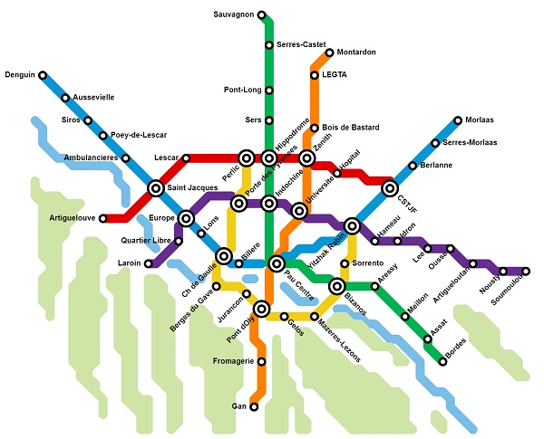

Nous traitons ici les sujets qui font la différence entre les candidats. Vous pouvez consulter les réponses partagées publiquement en bas de la page dédiée à Gan sur le site “Parlons Vélo”.

Deux listes sont inscrites pour la « grande » commune (+ de 5000 habitants) du sud de l’agglomération paloise :

- La liste du Maire sortant Francis Pées : « Gan, l’Avenir avec vous »
- La liste d’opposition menée par Valérie Cambon : « Gan, tissons un lien durable »

Le délai était relativement cours entre la diffusion de notre manifeste et la clôture des participations. Seule la liste de Valérie Cambon en a profité en faisant la démarche de nous rencontrer avant de partager ses engagements sur la plateforme Parlons-Vélo.

La seule contribution de la liste de M. Pées a été de nous rappeler laconiquement sur Messenger que son équipe « œuvre pour favoriser les mobilités douces au sein de la commune », suivi d’une question toute symbolique de la qualité des échanges entre communes de l’agglomération : « Pourriez-vous nous dire où en sont les échanges pour finaliser la liaison entre le sud de l'agglo et le centre-ville de Pau ? ». 

L’équipe en place a brillamment œuvré pour faire avancer l’aménagement de la Voie Verte de la Vallée d’Ossau sur son territoire communal, mais de nombreux signaux nous indiquent que la connexion avec les communes voisines au Nord et au Sud rencontre des difficultés. Et cette dernière question posée à un simple acteur associatif ne fait que le confirmer. La liste Cambon exploite cette lacune et indique vouloir « entretenir avec les communes voisines des réunions de travail pour relier les réseaux cyclables, notamment avec Jurançon avec lequel nous avons le flux le plus fort ».

La liste Valérie Cambon, représentée par Nicolas Desilles, s’engage à la mise en place d’un plan vélo sur la durée du mandat, avec un budget pouvant atteindre 12 à 15 €/an/habitant et visant à doubler la part modale du vélo. Objectif ambitieux, ou pas, vu le volume actuel de déplacement à vélo dans Gan, mais il faut bien se lancer.

L’engagement de Mme Cambon est fort pour poursuivre le projet d’aménagement de la Voie Verte, créer des connexions sécurisées entre les différents quartiers de la commune, jalonner et entretenir les itinéraires cyclables. Sa liste s’engage à rendre la ville plus agréable en limitant le trafic de transit motorisé dans le centre-bourg, en réaménageant la place de la Mairie (plus de végétal, moins de stationnement voiture), en réduisant la circulation motorisée devant les établissements scolaires, en exploitant pleinement le stationnement situé en périphérie, et tout cela en concertation avec les riverains, les commerçants et les associations d’usagers, via un comité « déplacement doux » qui se réunira au minimum 6 fois par an.

De plus, la généralisation des double-sens cyclables, des sas vélo et des cédez-le-passage cycliste aux feux semble faire partie de la palette d’outils envisagée par la liste Cambon pour encourager à l’usage du vélo dans les déplacements. L’ambition s’arrête en revanche dès qu’il s’agit d’investir dans des boxs pour vélos, dans l’aide à l’achat de matériel ou l’installation de compteurs de passage. Le budget serré d’une petite commune comme Gan oblige à des restrictions.

Comme il a été relevé lors de notre rencontre, par ses réponses, l’équipe de Valérie Cambon montre sa volonté d’œuvrer d’avantage en coopération avec les collectivités voisines, en s’engageant notamment dans la connexion de la voie verte existante au Réseau Express Vélo intercommunal. Et l’extension du projet de Maison du Vélo à l’ensemble de l’agglomération ouvre de nouvelles opportunités pour développer l’usage de la pratique.

Autre point fort : la liste Cambon souhaite participer à la « Journée mondiale sans voiture » en limitant le trafic motorisé dans le centre-ville.

Nous ne manquerons pas de leur rappeler s’ils sont élus le 15 mars.
