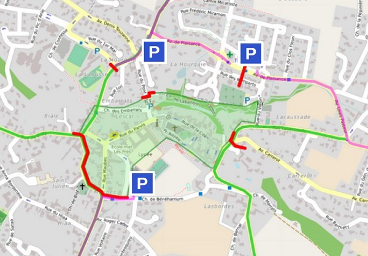

Nous traitons ici les sujets qui font la différence entre les candidats ayant répondu à notre questionnaire en ligne. Vous pouvez consulter notre manifeste et les réponses intégrales des candidats en bas de [la page dédiée à Lescar sur le site “Parlons Vélo”](https://municipales2020.parlons-velo.fr/e/25205).

Les trois candidats à la Mairie de Lescar (Jérôme Mange, Valérie Revel et au dernier moment, Frédéric Lavigne) ont joué le jeu en indiquant leurs engagements pour les modes de déplacement actifs, avec quelques commentaires brefs mais suffisants pour montrer leur sincérité.

MM. Mange et Lavigne ainsi que Mme Revel sont prêts à investir dans un plan vélo à Lescar et des adjoints en charge des mobilités sont déjà désignés pour consulter les usagers.

Les riverains du kilomètre et demi de l’avenue Denis Touzanne peuvent s’attendre à quelques nuisances liées aux travaux de rénovation dans les années à venir, surtout si M. Mange ou Mme Revel remporte l’élection, mais ils profiteront ensuite de voies cyclables pour simplifier leurs déplacements.

M. Mange et Mme Revel ont bien identifié des axes prioritaires à aménager et savent que la maîtrise d’œuvre sur ces grands axes revient à la communauté d’agglomération. Ils devront donc peser suffisamment dans les décisions prises à cet échelon de collectivité pour que la situation évolue rapidement sur ces axes accidentogènes. M. Lavigne n’a pas donné de priorité, mais évoque un « programme ambitieux de rénovation de la voirie », ce qui l’obligera au respect de la loi LAURE, donc à l’aménagement de voies cyclables.

Le boulevard de l’Europe (route de Bayonne) est dans toutes les têtes. Mme Revel a aussi retenu l’avenue du Vert Galant (D501), qui a récemment fait une victime cycliste de l’autre côté du pont sur la commune d’Artiguelouve. L’aménagement de cet axe est prioritaire pour « permettre de rejoindre de façon sécurisée la Véloroute ».

Aucun candidat ne souhaite s’engager rapidement sur une méthode simple et peu coûteuse pour empêcher le trafic de transit Nord-Sud dans le centre-ville. Ils préfèrent s’appuyer sur les conseils d’un cabinet avant de faire disparaître la circulation excessive de voitures dans les rues du Bie Grande, des frères Rieupeyrous et Mabec. M. Lavigne évoque un « équilibre indispensable entre toutes les mobilités » sans expliquer par quelle méthode atteindre cet équilibre dans des rues où le mode motorisé occupe tout l’espace. Tout le monde sait comme la construction de la voie rapide du « hauban nord » génère du trafic supplémentaire dans des rues déjà très fréquentées auparavant par les automobilistes, mais aucun candidat ne semble avoir lancé le moindre début d’analyse sur ce sujet majeur pour sauvegarder et redynamiser le centre-ville de Lescar…

Sur la redirection du trafic motorisé vers les grands axes et l’apaisement des quartiers par une généralisation des vitesses limitées à 30 km/h, M. Mange est bien plus emballé que Mme Revel. Même chose pour la généralisation des Double-Sens Cyclables, Mme Revel semble farouchement opposée à leur ouverture dans des rues qu’elle estime trop étroites, poursuivant la volonté de l’équipe sortante de privilégier le stationnement des voitures à des déplacements facilités pour les cyclistes (on pense aux rues du Bialé et du Hiaa, dont la seule alternative pour un transit Ouest-Est à vélo reste le dangereux boulevard de l’Europe). 

M. Lavigne, quand à lui, est opposé à une généralisation de la zone 30, de même qu’à toutes ces solutions simples et peu coûteuses que constituent le Double-Sens Cyclable, le Sas Vélo et les « cédez-le-passage cyclistes au feu ». Ce programme peu ambitieux, peu enclin à comprendre les besoins des cyclistes du quotidien, indique que son utilisation du vélo « en famille » doit être loin de l’exemplarité d’un Maire qui ferait la majorité de ses déplacements à vélo dans la commune.

Dans les actions nécessaires au développement de la pratique cyclable, Mme Revel indique vouloir mettre en place une aide communale à l’achat de vélos (sous condition de ressources). Ce qui serait une grande première dans l’agglo et offrirait la possibilité d’obtenir une aide complémentaire de l’État.

Pour finir, M. Mange et M. Lavigne sont ouverts à l’organisation d’une « journée sans voiture » dans un périmètre limité de la commune, contrairement à Mme Revel. Ce sera certainement une occasion de voir plus de lescarien.ne.s se déplacer autrement qu’en voiture, et notamment à vélo, aux côtés de nos candidats !
