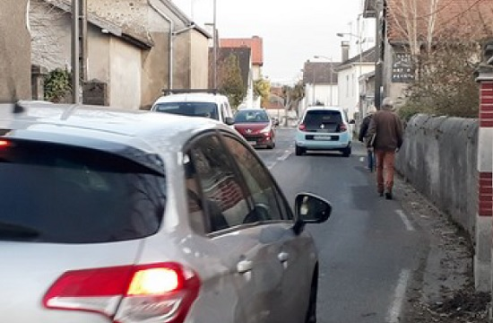

Nous traitons ici les sujets qui font la différence entre les candidats ayant répondu à [notre questionnaire](https://municipales2020.parlons-velo.fr/q/24880). Vous pouvez consulter les réponses intégrales des candidats en bas de [la page dédiée à Mazères-Lezons sur le site “Parlons Vélo”](https://municipales2020.parlons-velo.fr/e/25243).

La représentante du candidat Philippe Glorieux (Julie Champagne) a copieusement répondu au questionnaire en ligne en se montrant plutôt volontaire pour favoriser les modes actifs dans les déplacements à Mazères-Lezons.

De son côté, Monique Sémavoine a trouvé le questionnaire trop long, et surtout « inadapté à la taille de son village ». Selon elle, « les questions sont assez décalées par rapport aux réalités communales et aux moyens (humains et financiers) d’un village de 1850 habitants. » Elle nous a néanmoins transmis une réponse écrite, sur laquelle nous nous appuyons pour cette analyse.

Pour la création d’un plan vélo communal, alors que la liste Glorieux offre une réponse particulièrement construite et exhaustive, disant vouloir « intégrer toutes les parties prenantes (usagers de ces voies, associations, riverains), dans une démarche de démocratie participative pour la planification des changements nécessaires de nos modes de déplacement », Mme Sémavoine indique ne pas avoir « besoin de faire la preuve de sa volonté politique de développer les déplacements à vélo » en s’appuyant sur le bilan de ses 2 précédents mandats. 

Pour ce qui concerne la formation des techniciens aux aménagements spécifiques liés à la mobilité active, la liste Glorieux répond intelligemment qu’elle suggérera « des formations mutualisées entre communes de l’agglomération ». Une très bonne idée pour favoriser les communes de petites tailles encore peu expérimentées dans ce domaine.

Mme Sémavoine rappelle à juste titre qu’elle est à l’initiative des premières voies cyclables à Mazères-Lezons « en site propre ou en zone partagée », et qu’elle a créé « une traversée partagée « assez douce » d’Ouest en Est du village, parallèle à la RD37, qui passe par les rues Barthou et Pasteur dont 600 mètres en site propre ». Elle promet dans son projet de la mettre en valeur par l’ajout de nouvelles signalétiques. Engagement repris par la liste Glorieux, qui va plus loin en désirant « indiquer les distances et temps moyens de parcours pour relier les pôles d’attractivité du village et des communes voisines ».

La réponse de M. Glorieux est assez loquace sur les propositions de sécurisation de l’avenue du Général de Gaulle (point majeur relevé dans notre manifeste), avec une option de mise en sens unique pour les voitures ainsi que sur la nécessité de limiter le trafic motorisé dans la rue Jules Ferry qui accueille de nombreux services liés à l’enfance.

Aucun candidat n’envisage l’option radicale proposée par Pau à Vélo de supprimer tout trafic de transit sur l’axe historique de la commune (Charles de Gaulle). Ce n’est donc pas demain que nous verrons des enfants jouer en liberté dans cette rue qui mériterait d’être d’avantage mise en valeur, comme nous le soulignions dans notre manifeste.

M. Glorieux et Mme Sémavoine s’engagent sur la création de zones 30, mais la liste Glorieux insiste sur la nécessité de « séparer autant que possible les flux motorisés et non-motorisés ». La liste Glorieux s’engage sans condition à généraliser les double-sens cyclables, sas vélo et cédez-le-passage cycliste aux feux, des aménagements simples et peu couteux qui facilitent grandement les déplacements à vélo.

Là où le candidat Glorieux s’attarde essentiellement sur la partie basse de la commune pour l’apaisement de la circulation, Mme Sémavoine aborde également dans son programme une réduction des vitesses sur la route des côteaux / route de Piétat. Afin de bouleverser nos déplacements au quotidien, l’usage des modes doux ne doit effectivement pas se limiter aux secteurs denses. La représentante de M. Glorieux reconnaît cependant la nécessité d’inciter le plus grand nombre au report modal, particulièrement à Mazères-Lezons, « situé en périphérie de l’agglomération, où la tendance est très marquée par l’usage très systématique de la voiture. »

Alors que Monique Sémavoine se vante d’avoir « installé 2 range-vélos au Terminus de la ligne de bus Idélis à la limite d’Uzos, un autre à l’église et 4 autres à la mairie », Philippe Glorieux s’engage à remplacer les pince-roues par des arceaux vélos permettant d’attacher le cadre de son vélo en sécurité.

Mme Champagne, répondante pour la liste Glorieux, évoque même la mise en place d’un « Système Vélo », « nécessitant, au-delà de la création de pistes cyclables, une réelle dynamique autour du vélo ». Une expression qui fait plaisir à entendre de la part d’une potentielle future élue. Elle se dit ouverte à la réflexion pour l’acquisition de matériel, mais ne propose rien de transcendant par rapport à l’offre actuelle d’IDEcycle. Sur le volet équipement, Mme Sémavoine rappelle qu’elle a « acheté pour les prêter gratuitement sur simple demande : 2 tricycles à assistance électrique avec grand panier pour les courses, siège bébé et accessibles d’utilisation à des PMR. »

Nos deux interlocutrices ont déjà prouvé leur exemplarité en se déplaçant très régulièrement à vélo, mais M. Glorieux ferait-il un aussi bon ambassadeur que Mme Sémavoine quand il s’agit d’inaugurer un nouvel aménagement ? A vous de départager les deux candidats !
La réponse complète de la liste de Philippe Glorieux (« Mazères Lezons, écologiste solidaire et citoyenne ») est à retrouver sur la plateforme Parlons-Vélo : https://municipales2020.parlons-velo.fr/s/744
