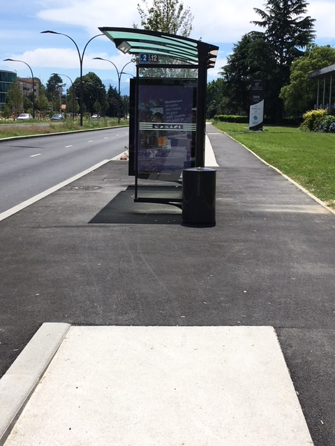

Si vous consultez [la page qui liste nos réunions][], vous savez que nous
rencontrons les services techniques municipaux depuis le mois de mai.  Nos
interlocuteurs font partie du pôle "mobilité et espaces publics", et le
directeur de ce pôle a été présent à plusieurs occasions. Nous n'en sommes pas
encore au point où nous sommes systématiquement consulté en amont de tout projet
urbain ou de voirie ([engagement 2][]), et invités à chaque commission
circulation ([engagement 3][]). Et puis, nous attendons toujours une vraie
rencontre pour parler vélo avec M. Bayrou ([engagement 2][]), nous lui avons
réclamé plusieurs fois par oral et par écrit depuis le mois d'avril. Cependant,
ces réunions avec les services techniques sont une avancée dans le dialogue. Ils
nous permettent de mieux cerner les projets en cours et à venir, d'émettre nos
avis et suggestions sur ces projets, et d'obtenir plus facilement des retours sur 
nos propositions, nos mécontentements et nos questions.

Malheureusement, les services techniques ne souhaitent pas que les documents
qu'ils nous présentent en réunion soient publiés ici. Reste la possibilité
d'organiser des réunions pour les présenter et en parler avec les adhérents
interessés (merci de nous écrire à l'adresse mail en [bas de page](#footer)).

Après une réunion où ils nous ont présenté le réseau cyclable qu'ils envisagent
pour 2020, notre constat de base a été un manque d'ambition politique pour le
vélo au regard des enjeux d'avenir. Mais nos interlocuteurs n'étaient pas des
interlocuteurs politiques. Passé ce constat nous leur avons donc transmis un
premier retour sur leurs projets, et nous avons abordés d'autres points.

Vous pouvez [consulter ici le diaporama que nous leur avons présenté][retour2020]

La ligne BHNS fait bien entendu parti du réseau envisagé, et le clou du spectacle 
est l'arrêt de bus installé au milieu de la piste cyclable. 

Si la situation ne  change pas avant l'inauguration, il faudra envisager une
action face à cette méprise symbolique qui en dit trop long sur la négligence
affichée face à l'enjeu vélo.

Vous pouvez [consulter ici le document que nous leur avons transmis suite à nos
observations le long de la ligne BHNS][BHNS].

Nous avons également profité de cette réunion pour leur transmettre [un premier
document sur l'avenue du Corps Franc Pommies][], un endroit où on ne trouve aucun
aménagement piéton ou vélo alors que la population s'est fortement densifiée.
Nous leur transmettrons prochainement un document plus abouti.

Face au constat d'un très faible budget alloué à la voirie en général (hors
BHNS), et donc à la voirie vélo en particulier, nous leur avons rappelé la
nécessité criante de prioriser le déplacement à vélo, et présenté le plan de
circulation mis récemment en place à Gand (Belgique). Ce plan

* limite drastiquement le transit automobile de courte distance,
* apaise la circulation,
* favorise le vélo et les transports en commun,
* ne nécessite pas d'investir lourdement dans les infrastructures.

Il est inspiré de celui mis en place pour Groningen (Pay-Bas) dans les année 80,
et on retrouve cette logique dans de nombreuses autres villes, comme Houten
(Pays-Bas). Vous pouvez [consulter notre présentation sur ce sujet ici][Gand et compagnie].

Nous leur avons aussi glissé des idées qui ne coûtent pas grand chose, comme
[les vélorues][], où il est interdit de dépasser les vélos (grand minimum pour
sécuriser la place Gramont en montée), ou encore [les céder-le-passage au
feux][] (pas que pour tourner à droite).

[la page qui liste nos réunions]: /ca/2018/#reunions
[engagement 2]: 
[engagement 3]:  
[retour2020]: pau-a-velo-retour-2020-ST.pdf
[Gand et compagnie]: pau-a-velo-presentation-gand-ST.pdf
[BHNS]: pau-a-velo-bhns-juin2018.pdf
[un premier document sur l'avenue du Corps Franc Pommies]: pau-a-velo-corps-franc-pommies-juin2018.pdf
[les vélorues]: https://www.facebook.com/brutofficiel/videos/2025917650991205/
[les céder-le-passage au feux]: https://www.youtube.com/watch?v=aJLGJrZP5jk
