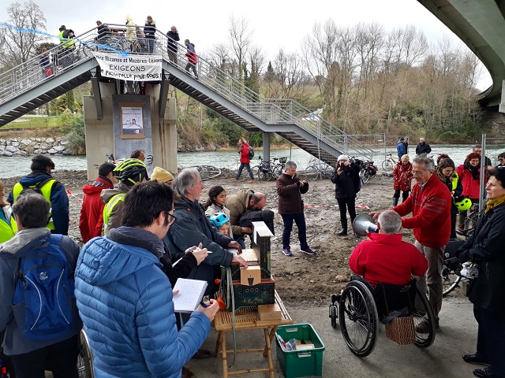
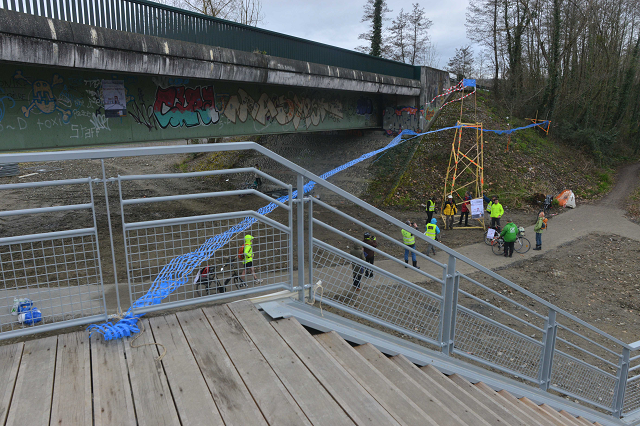
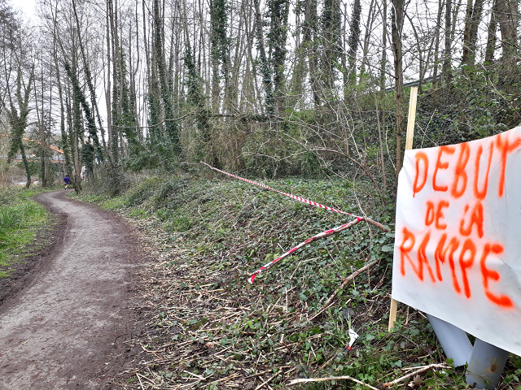

Le **dimanche 4 mars 2018**, nous étions environ 150 à nous réunir à [l'appel
initié par Pau à vélo](/events/rassemblement-passerelle-ubuzanos) et soutenu
par 4 autres associations:

*   Association Françaises des véloroutes et voies vertes (AF3V)
*   Association des paralysés de France (APF)
*   Handisport
*   Ville partagée

Nous avons pu présenter au public [le projet d'accessibilité élaboré par Pau à
Vélo](/evenements/passerelle-pour-tous2018/2018-03-04_livret-projet.pdf).
Pour la journée, un monument symbolique éphémère a été monté sur place pour
représenter ce projet: un pilier de bois de 5m de haut, relié à la passerelle et
au talus de la rocade par des rubans matérialisant le tracé de la rampe d'accès
que nous proposons.   M. Arribes (maire de Bizanos), et M. Capéran (pour la
communauté d'agglomération de Pau) étaient présents, et nous avons pu leur
remettre le livret de présentation du projet. Ils nous ont fait part de leur
volonté de contribuer à améliorer la situation, en empruntant si possible la
solution proposée par Pau à Vélo. M. Capéran devrait convier dans la semaine les
associations à une réunion à ce sujet.

Des textes avaient été prévus pour l'occasion et ont pu être lu sur place (ou
pas, il y a eu un couac d'organisation sur le sujet dont a été victime l'AF3V)

*   [texte prévu par Julien Savary (AF3V)](discours-af3v-savary.pdf), venu spécialement de Toulouse pour l'occasion
*   [texte lu par Bernard Mirande, pour l'APF](discours-apf-mirande.pdf)
*   [textes lus par Sébastien Lamy](discours-pau-a-velo-lamy.pdf), et [texte lu par Maïa Ricadat](discours-pau-a-velo-ricadat.pdf), pour Pau à Vélo
*   [texte lu par Catherine Chevalier, pour Ville partagée](discours-vp-chevalier.pdf)
*   [texte adapté sur place par Michel Barrère](contribution-barrere.pdf), administrateur de Pau à Vélo et membre de Ville partagée.

L'ambiance musicale a été assurée par Léon Crécent et son orgue de Barbarie, qui
nous a notamment interprété "Quand on s'promène au bord de l'eau", de Jean Gabin.

La presse a bien couvert le sujet:

* France Bleu au [journal de 7h](2018-03-05_FranceBleuBearn_Passerelle_Bizanos_032bps.mp3)
  et au [journal de 8h](2018-03-05_FranceBleuBearn_Passerelle_Bizanos_2_032bps.mp3)
  le lundi
* France 3 Pau Sud aquitaine à 19h30 le lundi soir ([télécharger ici l'extrait](2018-03-05_France3_Pau-Sud_19-20_Passerelle.ts)
  ou [regarder le journal complet en ligne](http://embedftv-a.akamaihd.net/e792e92fa5739fb362601263a04a3302) entre 2'16 et 3'50)
* [Sud ouest sur le rassemblement du 4 mars pour une passerelle accessible](http://www.sudouest.fr/2018/03/04/bizanos-pres-de-150-personnes-pour-l-accessibilite-de-la-passerelle-de-mazeres-4250142-4344.php)
* [La république sur le rassemblement du 4 mars pour une passerelle accessible](http://www.larepubliquedespyrenees.fr/2018/03/04/passerelle-sur-le-gave-les-associations-presentent-leur-contre-projet,2294009.php)

Il y a aussi nos reportages internes:

* [Les photos de Philippe Vignolles (et une vidéo dans le lot)](https://photos.google.com/share/AF1QipMQxNOqvZptSDtxk5DoKdcT3dtE6UHS3xdGFXK2iLtEYk3bbeo6NtiViWyhMNGTIQ?key=ZUVRTllzMFlSbkRYWDJQNW1pYThfT2s2dG5QRnJ3)
* [Les photos de Hervé Laurent à télécharger](photos_herve.zip)
* [La vidéo montée par Hervé Laurent](https://youtu.be/WAwA5cHuL9s), un
  extrait du dialogue avec les élus y est inclus
* [Les photos de Hanna à télécharger](photos_hanna.zip)
#### Photos d'Hanna


#### Photos d'Hervé


Bravo à tous ceux qui ont contribué au succès de cette journée.
